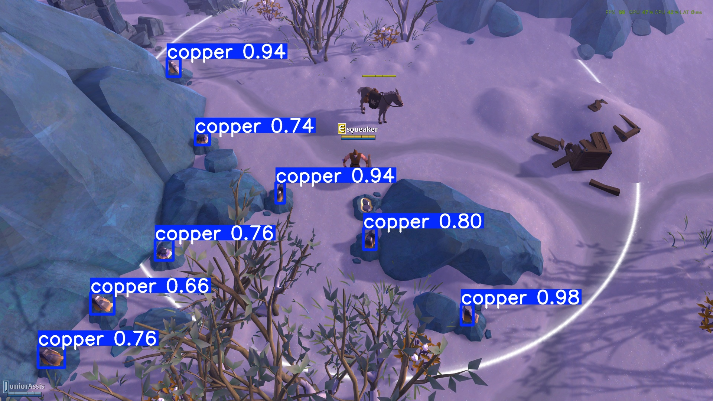

# ⛏️ Albion Online Copper Object Detection | Built with YOLOv8

This project leverages YOLOv8 (You Only Look Once version 8) for object detection to identify and locate copper ore within the Albion Online game world. Although my motivation for this project was for experimenting with YOLO and not automated farming, the copper farming functionality is still there.

## Resources
* [Roboflow Dataset Repository](https://universe.roboflow.com/tinker-abus7/albion-copper-recognition/dataset)

## Technologies Used

* ultralytics
* roboflow
* pyautogui

## Author(s)
* [@Spring-0](https://github.com/Spring-0)

## Demo

